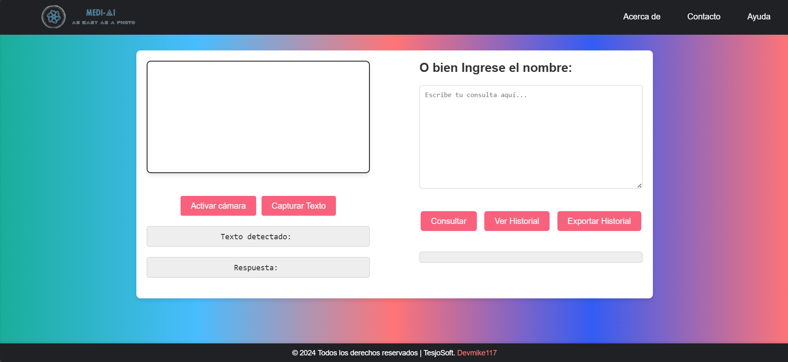

# Proyecto de Detección de medicamentos por IA

<p align="center">
  
</p>


Detector medi-IA es una herramienta basada en Inteligencia Artificial (IA) diseñada para ayudar a los usuarios a procesar texto en tiempo real de imágenes o videos. Gracias a tecnologías avanzadas como el Reconocimiento Óptico de Caracteres (OCR) y procesamiento de lenguaje natural, el programa puede captar textos de cualquier fuente visual y ofrecer respuestas contextualizadas, realizar consultas y exportar el historial que el usuario tiene.

## Descripción

El sistema consta de una interfaz web donde se puede activar y desactivar la cámara, capturar una imagen, y procesar el texto detectado en la imagen para obtener detalles sobre medicamentos (nombre comercial, nombre científico, acción farmacológica, etc.) utilizando un modelo de inteligencia artificial. Los resultados y el historial de consultas se almacenan en el `localStorage` y se pueden exportar a un archivo `.txt`.

## Requisitos
- Cámara web o de dispositivo móvil, laptop.
- Navegador compatible con la API de acceso a la cámara por ejemplo:

|                       | 
|----------------------------------|
| **Firefox**        | 
| **Microsoft Edge**          |                       |
| **Google Chrome**                | 
| **Safari**            |
| **Brave**            |
- Conexión a internet estable.


## Instalación

1. Clona este repositorio o descarga los archivos del proyecto.
2. Asegúrate de tener una clave API de **OCR.space** para el procesamiento de imágenes.
3. Obtén tu API Key para **Google Gemini** y configúralo en el código.
4. Abre el archivo `index.html` en tu navegador para ver la interfaz.

## Funcionalidades

1. **Acceso a la Cámara:**
   - Permite al usuario activar y desactivar la cámara.
   - Los usuarios pueden seleccionar entre varias cámaras disponibles.
   - La cámara se muestra en tiempo real en la interfaz.
   - Se puede capturar una imagen de la vista de la cámara.

2. **Captura y Procesamiento de Texto:**
   - El texto en la imagen capturada se procesa usando OCR.
   - Los resultados de OCR se muestran en la interfaz.
   - Si el texto hace referencia a un medicamento, el sistema genera detalles sobre el medicamento.

3. **Interacción con la IA:**
   - Usando la Inteligencia Artifical, el sistema proporciona respuestas detalladas sobre medicamentos.

4. **Historial de Consultas:**
   - El historial de consultas y respuestas se guarda en el `localStorage`.
   - Se puede visualizar el historial de consultas previas en la interfaz.
   - Se puede eliminar entradas del historial.
   - El historial se puede exportar a un archivo `.txt`.
## Tecnologías

| Tecnología                      | Descripción                                                                 |
|----------------------------------|-----------------------------------------------------------------------------|
| **JavaScript (Frontend)**        | Utilizado para la captura de imágenes, la interacción con la API de OCR, y la visualización de los resultados. |
| **HTML/CSS (Frontend)**          | Estructura y estilos para la interfaz de usuario.                           |
| **API OCR.space**                | Para realizar el reconocimiento óptico de caracteres en las imágenes capturadas. |
| **Node.js (Backend)**            | Para la gestión de las solicitudes API y la comunicación entre el frontend y el backend. |
| **emailjs (Backend)**            | Para el envio de mensajes a traves de correo electronico. |


## Funciones Principales

| Función                          | Descripción                                                                 |
|-----------------------------------|-----------------------------------------------------------------------------|
| **requestCameraPermission()**     | Solicita permisos para acceder a la cámara.                                 |
| **getCameras()**                  | Obtiene las cámaras disponibles.                                            |
| **activateCamera()**              | Activa la cámara seleccionada.                                              |
| **deactivateCamera()**            | Desactiva la cámara.                                                       |
| **captureBtn.addEventListener()** | Captura la imagen y procesa el texto usando OCR.                            |
| **model.generateContent()**       | Interactúa con el modelo de IA para generar respuestas relacionadas con medicamentos. |

## Uso

1. **Activar la cámara**: Haz clic en el botón de cámara para activar la cámara. Si hay varias cámaras disponibles, selecciona una de la lista desplegable.
2. **Capturar texto**: Haz clic en el botón "Capturar texto" para tomar una foto del texto que aparece en la cámara. El texto detectado se procesará automáticamente.
3. **Historial de consultas**: Haz clic en "Ver Historial" para revisar las consultas anteriores y sus respuestas. Puedes eliminar entradas del historial o exportarlo.
4. **Exportar Historial**: Haz clic en "Exportar Historial" para descargar el historial de consultas y respuestas como un archivo `.txt`.
   
## 🛠️ Instalación

Clonar repositorio:
```shell
git clone https://github.com/Devmike117/medi-IA.git
```

## Contribuciones

Si deseas contribuir al proyecto, siéntete libre de hacer un fork del repositorio y enviar pull requests con tus cambios.

## Licencia

Este proyecto está bajo la Licencia MIT - consulta el archivo [LICENSE](LICENSE) para más detalles.

## Autor

Miguel GH
